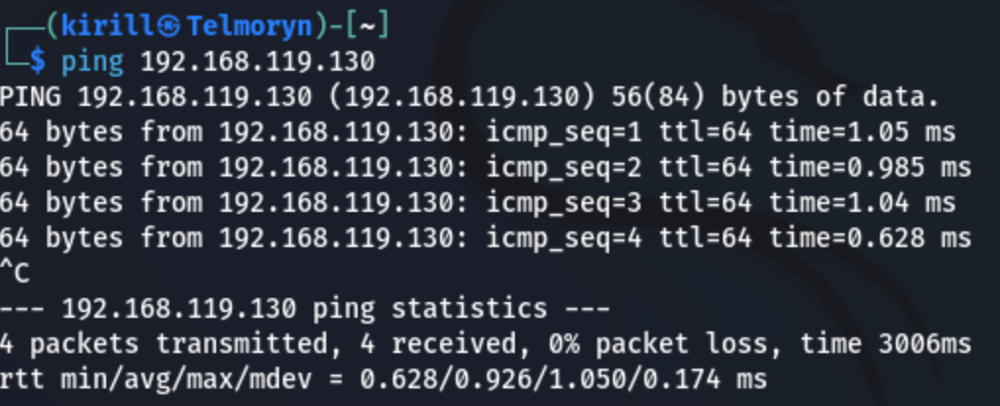

# Отчет по проделанной работе.

## Выбор гипервизора и ОС для создания виртуальных машин

В качестве гипервизора был выбран _VMware Fusion_, в качестве ОС: _Kali linux_, _Ubuntu_ и _Ubuntu Server_.

## Реализация подключения.

В качестве связи была выбрана стандартная _NAT_ сеть. Все остальное реализовано под капотом гипервизора. Подключение велось локально.

## Проверки подключения
При помощи команды `ifconfig` я получал информацию о текущей локальной машине, а затем при помощи команды `ping` проверял передачу пакетов между виртуальными машинами.

